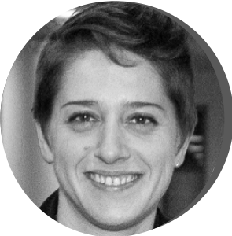

## Membres fondateurs

  

  

  

{width=50%}

**Yuna BLUM**    
Research scientist, CNRS   
GEO Team, IGDR Rennes, France  
[Read more](members/members_yb.html) 

  

  

{width=50%}

**Sylvie JOB**   
Research scientist, Inserm  
Paul-Brousse Hospital Paris, France  
[Read more](members/members_sj.html) 

  

{width=50%}

**Remy NICOLLE**   
Research scientist, CIT Program  
Ligue Contre le Cancer Paris, France  
 [Read more](members/members_rn.html) 

  

{width=50%}

**Mira AYADI**    
Operational Director, CIT Program  
Ligue Contre le Cancer Paris, France  
[Read more](members/members_ma.html) 

  

  

{width=50%}

**David TAVEL**   
Data Manager, CIT Program  
Ligue Contre le Cancer Paris, France  
[Read more](members/members_dt.html) 

 