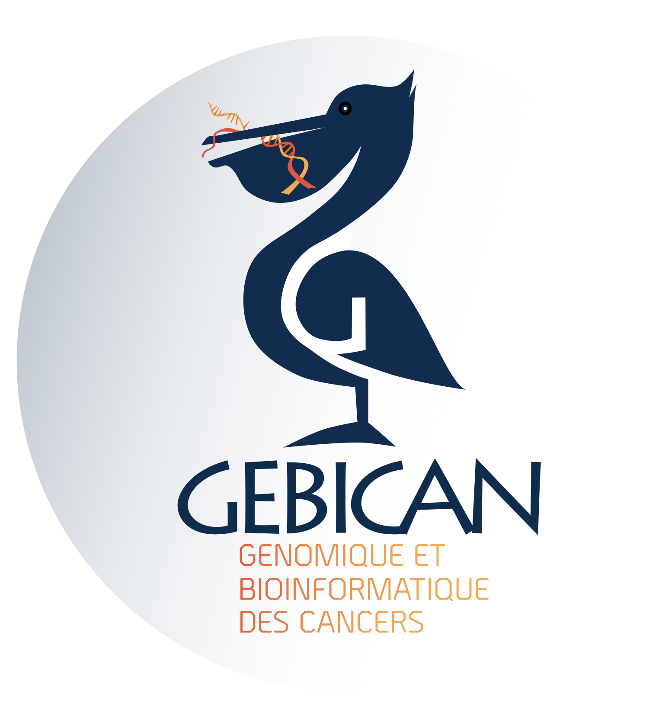
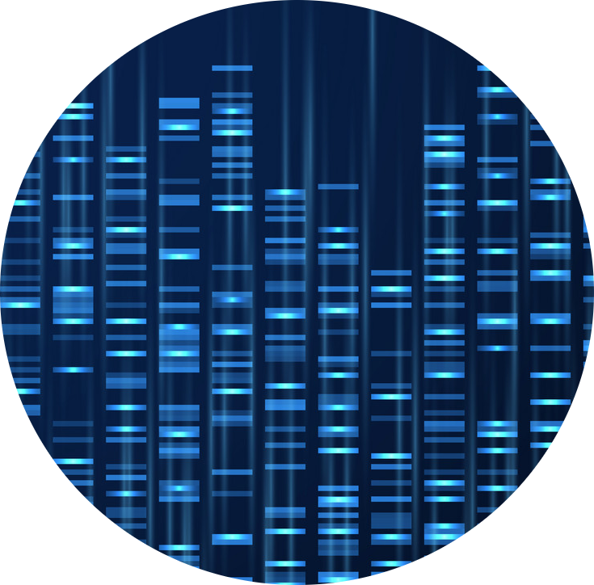

```{r setup, include=FALSE}
knitr::opts_chunk$set(echo = TRUE)
```

```{r pressure3, echo=FALSE, out.width= "25%", out.extra='style="float:right; padding:10px"'}

```


### GeBiCan est une association française dont l’objectif principal est de promouvoir et d’aider la recherche en **Bioinformatique et Génomique des cancers**.

Ensemble, nous nous sommes fixés plusieurs objectifs :

{width=4%} Réunir et favoriser les **contacts entre tous les acteurs de la recherche en oncologie**. Nous favorisons les rencontres et les collaborations entre biologistes, bioinformaticiens, médecins, étudiants ou industriels, au travers de journées thématiques ou de workshops. 


{width=4%} GeBiCan propose également un accès facilité aux **données génomiques** d’un panel de cancers, présentes sur plusieurs bases de données publiques. 


{width=4%}  Enfin, GeBiCan rassemble un ensemble d'**applications** et d'**outils** utiles à l'analyse de données génomiques.


Si notre association vous intéresse, n'hésitez pas nous [contacter](gebican.asso@gmail.com).

L'assocation et son site sont encore en construction ...
