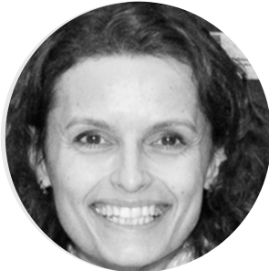

{width=10%}
 

Trained as a biologist, **Sylvie Job** moved on to an in silico biology PhD dedicated to modelling the gene networks. She joined the CIT program in 2011 after two post-doctoral stages in bioinformatics and biostatistics. She is currently specialized in the oncogenomics research on pheochromocytoma, cholangiocarcinoma, breast and kidney cancers
 
