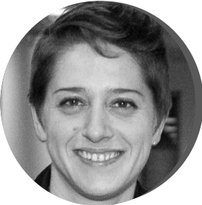

{width=10%}
 

**Yuna Blum** holds a PhD in genetics and applied statistics. After a year as an associate professor in the Department of applied statistics at Agrocampus Ouest in France, she pursued her research on high-throughput molecular data integration in metabolic diseases at the University of California, Los Angeles. In 2015, she joined the "Cartes d'Identité des Tumeurs" research team in Paris before being recruited as a research scientist at the CNRS in 2020. She has been leading projects in cancer genomics for several years and is involved in methodological developments for a better understanding of intra-tumor heterogeneity. 

[Website](http://www.yuna-blum.com)

